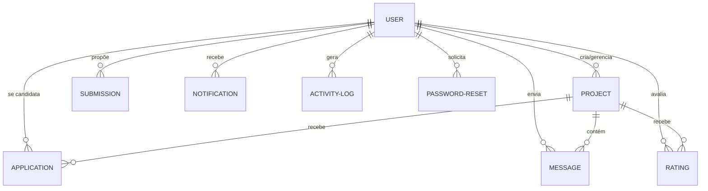

# 📘 Análise Completa do SisCPTI (Sistema de Gestão do Caderno de Projetos de TI)

O **SisCPTI** é um sistema web dinâmico e funcional desenvolvido como parte da disciplina de **Projeto Integrador II** no **UNICEUB**. Seu propósito central é gerenciar o ciclo de vida de projetos de Tecnologia da Informação (TI), atuando como um catálogo e workspace integrado para aproximar estudantes, coordenadores/professores e empresas parceiras.

---

## 🏗️ 1. Arquitetura e Stack Tecnológica

O sistema foi estruturado seguindo uma arquitetura MVC simplificada utilizando Flask no backend, banco de dados relacional com SQLite via ORM (Object-Relational Mapping), e um frontend enriquecido com CSS puro e JavaScript nativo.

| Camada | Tecnologia / Biblioteca | Função Principal |
| :--- | :--- | :--- |
| **Backend** | Python 3.x + [Flask](https://flask.palletsprojects.com/) | Roteamento, controle de sessões, tratamento de arquivos, lógica de negócios e segurança. |
| **Persistência** | [Flask-SQLAlchemy](https://flask-sqlalchemy.palletsprojects.com/) | Mapeamento Objeto-Relacional (ORM) e interação com o banco de dados. |
| **Banco de Dados** | SQLite (`siscpti.db`) | Banco embarcado local (com PyMySQL listado em `requirements.txt` para suporte opcional a servidores MySQL). |
| **Frontend** | HTML5 Semântico + CSS3 Customizado | Estrutura, estilização responsiva e suporte nativo a temas Claro/Escuro via variáveis CSS. |
| **Interatividade** | JavaScript Nativo (Vanilla JS) | Validações em tempo real, manipulação de temas, Menu Hamburguer mobile e requisições assíncronas (AJAX). |
| **Gráficos** | Chart.js | Visualização dinâmica de métricas administrativas (distribuição por categoria/status). |

---

## 🗄️ 2. Modelagem do Banco de Dados

O banco de dados do **SisCPTI** contém 9 tabelas fundamentais que sustentam todo o fluxo operacional do portal:

### Detalhamento das Entidades:

1. **`User`**: Contas de acesso no sistema.
   * `id` (PK), `username` (Unique), `password` (armazenado em hash criptografado), `role` (`admin`, `professor`, `empresa`, `aluno`), `email` e `bio`.
2. **`Project`**: Projetos já validados e ativos no catálogo de desenvolvimento.
   * `id` (PK), `titulo`, `status` (ex: "EM EXECUÇÃO"), `professor` (orientador), `categoria`, `descricao_curta`, `imagem` (capa), `detalhes` (JSON estruturado), `links` (JSON estruturado) e `owner_username`.
3. **`Submission`**: Propostas enviadas pelas empresas e sob análise da coordenação.
   * `id` (PK), `nome_projeto`, `categoria`, `descricao`, `proponente`, `email`, `status` (ex: "EM ANÁLISE"), `username` (quem submeteu) e `imagem`.
4. **`Application`**: Inscrição dos alunos nas vagas de projetos abertos.
   * `id` (PK), `projeto_id` (FK), `username`, `motivo`, `experiencia` e `status` (`PENDENTE`, `APROVADA`, `REJEITADA`).
5. **`Message`**: Mensagens trocadas no Workspace do projeto.
   * `id` (PK), `projeto_id` (FK), `username`, `texto`, `arquivo` (caminho físico de anexos enviados) e `data_envio`.
6. **`Notification`**: Alertas in-app gerados para ações do usuário.
   * `id` (PK), `username`, `mensagem`, `lida` (booleano), `data_criacao` e `link` para redirecionamento rápido.
7. **`Rating`**: Avaliações enviadas por alunos aos projetos do catálogo.
   * `id` (PK), `projeto_id` (FK), `username`, `nota` (1 a 5), `comentario` e `data_criacao`.
8. **`ActivityLog`**: Auditoria de ações administrativas.
   * `id` (PK), `username`, `acao`, `detalhes` e `data`.
9. **`PasswordReset`**: Armazena tokens para redefinição de senhas com validade de tempo.
   * `id` (PK), `username`, `token` (Unique), `expira_em`.

---

## 🔄 3. Principais Fluxos Operacionais

### 🔑 A. Fluxo de Autenticação e Segurança
* **Cadastro e Login**: Senhas são processadas no backend com o algoritmo seguro do `werkzeug.security` (`generate_password_hash` e `check_password_hash`).
* **Proteção de Acesso**: Proteção nas rotas por verificação do `session.get('role')`.
* **Recuperação de Senha**: Envio de e-mail através de um helper SMTP. Caso o SMTP não esteja parametrizado no ambiente, o sistema exibe dinamicamente o link/token de recuperação para fins de depuração acadêmica.

### 💼 B. Fluxo de Submissão e Criação de Projetos
1. A **Empresa** realiza o login e submete uma proposta via formulário (`submissao.html`).
2. O **Administrador** visualiza a proposta no painel geral.
3. Se o administrador **aprovar**:
   * A `Submission` muda para status `APROVADA`.
   * Um novo `Project` é gerado automaticamente com status `EM EXECUÇÃO`.
   * O proponente original é definido como dono (`owner_username`).
   * O proponente recebe uma **notificação** in-app.

### 🎓 C. Fluxo de Candidatura e Workspace de Desenvolvimento
1. O **Aluno** acessa o catálogo, lê os detalhes do projeto (`projeto_detalhes.html`) e preenche sua candidatura.
2. O **Dono do Projeto** (ou Administrador) analisa os candidatos.
3. Se **aprovado**:
   * O status da candidatura é alterado para `APROVADA`.
   * O aluno é adicionado ao **Workspace do Projeto** (`workspace.html`).
   * O aluno recebe uma **notificação** contendo o link do Workspace.
4. **Workspace**: Área colaborativa com chat integrado e upload de arquivos. As mensagens do chat são atualizadas automaticamente via polling (`fetchNotifications` / `/api/notificacoes`) a cada 4 segundos no frontend.

---

## 🎨 4. Design e Experiência do Usuário (UI/UX)

* **Tema Dinâmico (Claro/Escuro)**: Configurado via CSS Variables (`:root` e `.dark-theme`) no arquivo `static/style.css`. O JavaScript salva a preferência do usuário no `localStorage` para manter a consistência entre navegações.
* **Marca do UNICEUB**: Aplicação do filtro CSS `.ceub-logo { filter: brightness(0) invert(1) }` para inverter dinamicamente a logo azul/preta padrão do UNICEUB para branca quando o modo escuro está ativado.
* **Validações no Frontend**: Formularização de alertas amigáveis aos usuários com auto-fechamento (fade-out automático de 3.5 segundos) e validação de senhas/e-mails em tempo real diretamente via JavaScript no arquivo `static/script.js`.

---

## 🚀 5. Pontos Fortes e Oportunidades de Melhoria

### 🌟 Pontos Fortes:
* **Robusteza do Backend**: Lógica limpa e coesa no `app.py`.
* **Migração Automática**: Sistema de migração manual inteligente integrado na inicialização para contornar limitações do SQLite em alterações de schema (como a falta de `IF NOT EXISTS` na instrução `ALTER TABLE`).
* **Logs de Auditoria**: Auditoria completa e exportação CSV estruturada para relatórios.

### 💡 Oportunidades de Melhoria para a Fase III:
1. **WebSockets (Socket.IO)**: Trocar o polling do chat e notificações (atualmente disparado a cada 4 segundos por requisição HTTP AJAX) por comunicação baseada em sockets bidirecionais ativos.
2. **Paginação do Catálogo**: À medida que o Caderno de Projetos crescer, implementar paginação no catálogo de projetos no backend para otimizar os tempos de renderização.
3. **Validação de Arquivos no Workspace**: Restringir no backend os formatos e tamanhos dos arquivos que podem ser anexados no chat para evitar riscos de segurança (RCE - Remote Code Execution).
